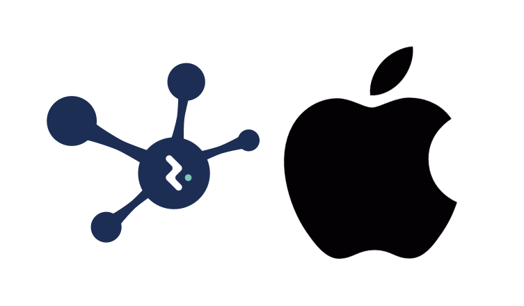

We are happy to announce **SOFA Robotics v25.06**, distributed with **Emio Labs v25.06**!

With this release SOFA Robotics is now available for macOS. 
The release also contains many new exciting features and improvements.
To upgrade, download the new version !

<!--truncate--> 

## Highlights

✨ You can now try SOFA Robotics for macOS ! Download it with [Emio Labs](https://mailchi.mp/compliance-robotics.com/download-emio-labs) or on [GitHub](https://github.com/SofaComplianceRobotics/SofaGLFW/tree/robotics).

## Other changes

### Enhancements
- We added options menu to the `Windows>Program>StartMove` block, allowing for instance to change the start position using the `Move` window. 
- The `Display Options` window has been moved to `View>Viewport`
- The size of the window is saved when you close the software
- The toggle button `Simulation/Robot` now integrates the connection with the robot. On a failed connection, have a look at `Windows>Log` or the Emio Labs log tab to understand why the connection has failed

### New features
- You can now display the origin and a grid, see `View>Viewport>Origin Frame` and `View>Viewport>Grid`
- You can now align the camera, see `View>Align Camera`
- A new window is available `Windows>Log` 

### Bug fixes
- We fixed display issues we had on some computers
- We also fixed the load / reload simulation (with python arguments) and added the short cut `ctrl+r`

