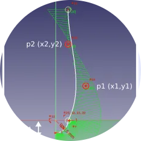

export function TOC() {
    return (
        <ul style={{ listStyleType: 'none' }}>
            <li><a href="#lab-1-models-for-soft-robotics">Lab 1. Models for Soft Robotics</a></li>
            <li><a href="#lab-2-inverse-kinematics">Lab 2. Inverse Kinematics</a></li>
            <li><a href="#project-1-pick--place">Project 1. Pick & Place</a></li>
            <li><a href="#lab-3-design">Lab 3. Design</a></li>
            <li><a href="#lab-4-closed-loop">Lab 4. Closed Loop</a></li>
        </ul>
    );
}

# TODO - Find your Labs

[find your labs](https://docs-support.compliance-robotics.com/Find-your-Labs-13c582ce7d3a802bbe72d37b72e02e50)

# Find your Labs

:::tip
Teach soft robotics with the original content created by Compliance Robotics. It provides a practical introduction to the concepts of soft robotics: models, inverse kinematics, pick & place, design, and closed loop.

*[Easily compose your labs and add your own content](https://www.notion.so/Create-your-own-Labs-13c582ce7d3a80ceb636ca3153f5594a?pvs=21). Share your content for Emio with the community. Contact us to add your content to this page by sending an email at this address [contact@compliance-robotics.com](mailto:contact@compliance-robotics.com).*
:::

# List of Available Labs & Projects

<TOC />

## Lab 1. Models for Soft Robotics

> Discover and analyse different models. Discover the accuracy and limitation of continuum mechanics models.

This lab aims to familiarize with certain deformable models used in the soft robotics community, particularly beam models and volumetric finite element models. It briefly describe three models and provide references for a deeper understanding. 

This lab consist of understanding these models and their parameters, and experimentally analyzing their behavior. To do so, different legs with various geometries are provided with the robot. Each leg leading to different mechanical behaviors. You will be able to confront the models with the legs one by one.

:::note

Author: Compliance Robotics
*Distributed with Emio*
:::

<figcaption> Lab 1. Models </figcaption>

## Lab 2. Inverse Kinematics

> Explore the principles of inverse kinematics as applied to soft robots, and write your own inverse kinematic solver in python.

In this lab, you will explore the principles of inverse kinematics (IK) as applied to soft robots. The kinematics of soft robots has been, and continues to be, a subject of extensive scientific research. 

Here, the proposed approach relies on the computation of mechanical models that consider the material properties, specifically utilizing compliance projected into the space of actuators and end effectors. 

By the end of this lab, you will have a better understanding of the concept of mechanical compliance and the formulation of an optimization problem that allows to get the inverse kinematics from the mechanical compliance model of soft robots.

:::note

Author: Compliance Robotics
*Distributed with Emio*
:::

<figcaption> Lab 2. Inverse Kinematics </figcaption>

## Project 1. Pick & Place

> Start from scratch, end up with a full deformable pick & place robot, and solve a pick and place task.

In this lab, we will test a simple pick & place example using a soft gripper attached to the robot's end-effector.

This exercise aims to apply the concepts studied and reinforce the student understanding of inverse models in soft robotics by programming a complete pick & place cycle.

:::note

Author: Compliance Robotics
*Distributed with Emio*
:::

<figcaption> Project 1. Pick & Place </figcaption>

## Lab 3. Design

> Design your own legs and gripper for Emio, and check their performance in simulation.

In this lab session, we will work on the design of the flexible legs composing Emio such that a pick & place task can be realized.In particular, we aim at picking an object which is not reachable with the initial design of the robot.For that purpose, we propose you to follow an iterative and interactive design process where fast mechanical simulations are used to predict the system behavior and performances.

:::note

Author: Compliance Robotics
*Distributed with Emio*
:::

<figcaption> Lab 3. Design </figcaption>

## Lab 4. Closed Loop

> Discover closed loop control strategies, from basic inverse kinematic proportional control, to state feedback plus observer
> 

This lab is dedicated to control. Its goals are to make you understand: 

- When and why a closed loop control scheme is required for a given application
- What are the effects of the different parameters of the controller
- The limitation of the proposed approach and what has to be done to overcome it
- And finally give some insight of what could be achieved with more time.

:::note

Author: Compliance Robotics
*Distributed with Emio*
:::

<figcaption> Lab 4. Closed Loop </figcaption>